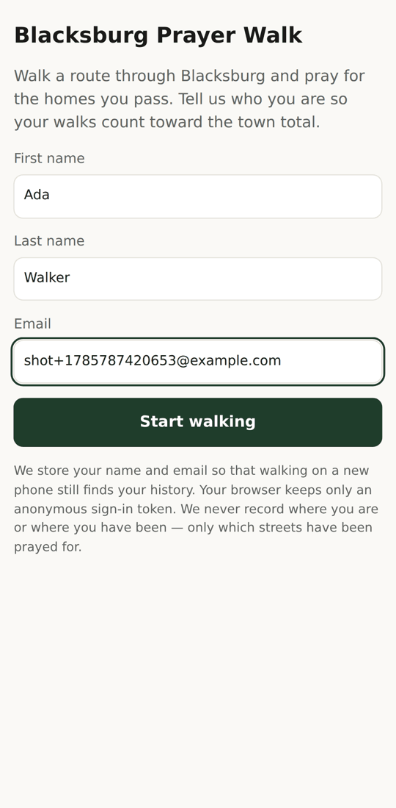
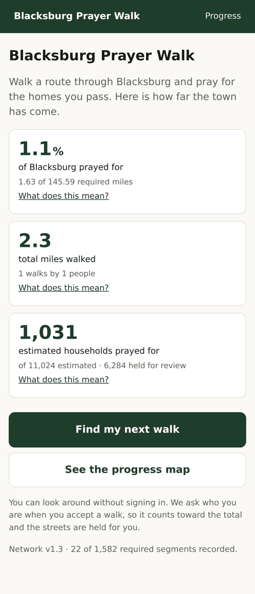
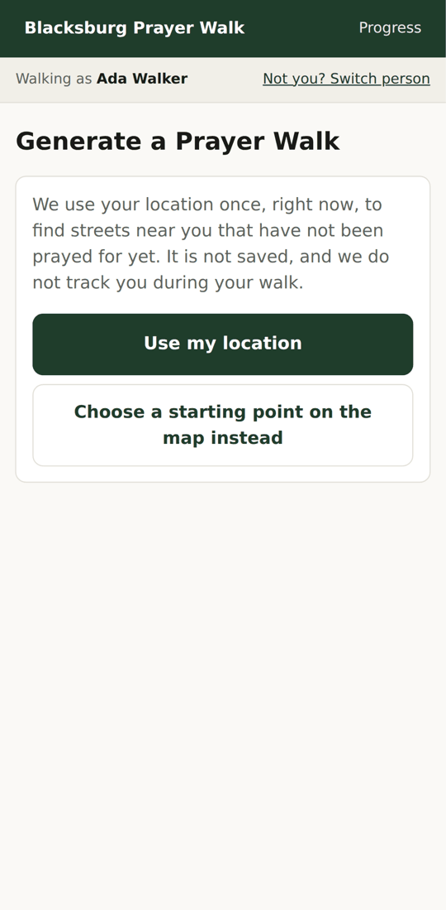
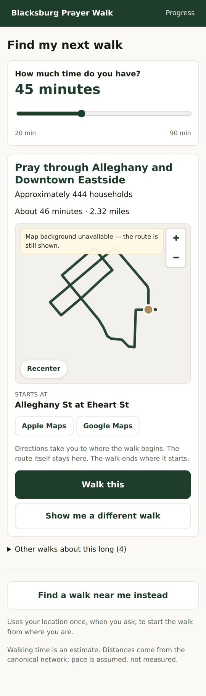
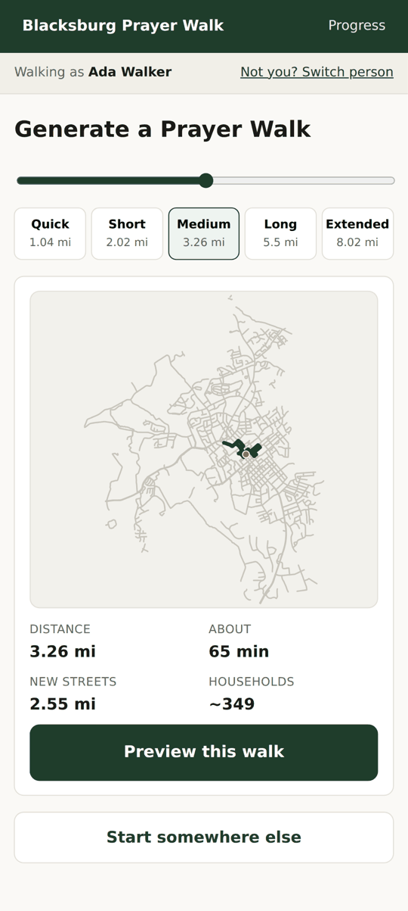
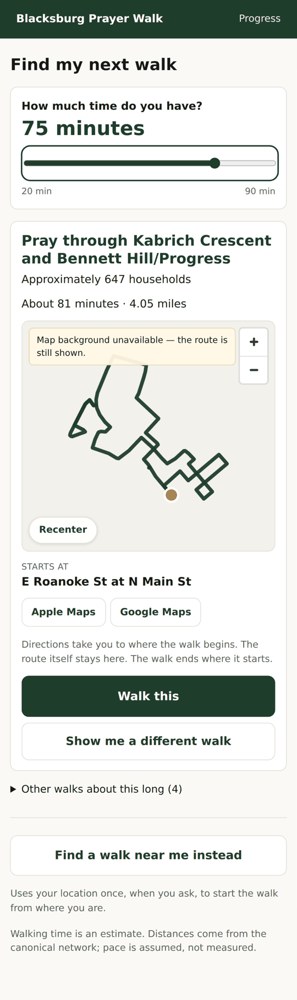
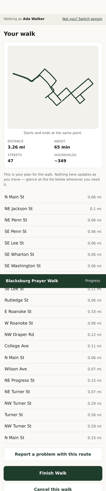
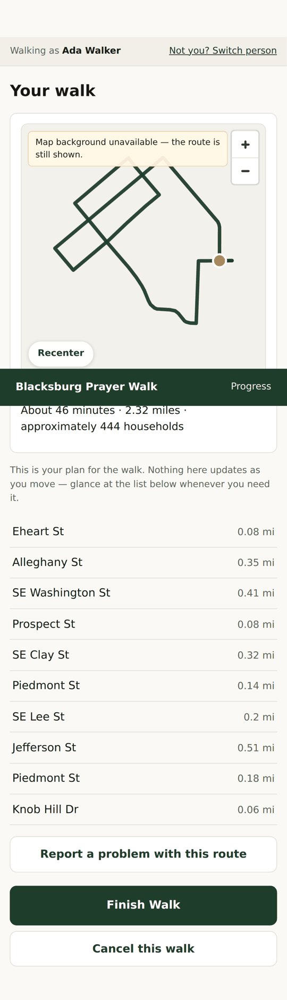

# Phase 3.5 — Product realignment and a testable mission-planning build

The application now opens on the town's progress, asks how much time you have, and
answers with a specific walk described in terms of where it goes and who lives there.
Identity is requested when you accept a walk, and not before. The map is a real map.

Everything below is implemented and running. What is *not* solved is stated in §9.

---

## 1. What changed, by priority

| # | Asked for | Status | Where |
|---|---|---|---|
| 1 | Real interactive map | **done** | `web/src/components/MapView.tsx` |
| 2 | Dashboard before identity | **done** | `web/src/screens/Dashboard.tsx`, `App.tsx` |
| 3 | Mission recommendation, not route configuration | **done** | `api/routing/missions.py`, `web/src/screens/Mission.tsx` |
| 4 | Continuous time slider, 20–90 min, step 5 | **done** | `Mission.tsx`, `mission_service.py` |
| 5 | No location required for the default walk | **done** | `GET /api/missions/recommend` takes no coordinates |
| 6 | Directions to the start | **done** | `mission_service.directions_links()` |
| 7 | "Find a walk near me" preserved as secondary | **done** | `Generate.tsx`, reached from the mission screen |
| 8 | Mission-focused information only | **done** | `to_payload()`; enforced by test and e2e |
| 9 | Neighbourhoods as narrative | **done** | `pipeline/build/neighborhoods.py`, network v1.3 |
| 10 | A slate for simultaneous walkers | **done** | `missions.discover()`, `mission_service.assign()` |
| 11 | Timing analysis | **done, and the answer is "not enough data"** | `api/routing/timing.py`, §6 below |
| 12 | Engine stays domain-neutral | **held** | §8 below |

### Before and after

| | Before | After |
|---|---|---|
| First screen |  |  |
| Asking for a walk |  |  |
| The walk you are given |  |  |
| Walking it |  |  |

The screenshots were taken in this build environment, where **every basemap tile host
is unreachable** — see §9.1. The banner reading "Map background unavailable" is the
degradation path working, not a defect. On a normal connection the same map draws
streets, labels and landmarks underneath the route.

Two screens are missing from the table on purpose. The progress map and the
confirmation editor both render the *entire* required network, and this repository does
not commit geometry derived from Town of Blacksburg GIS data (`.gitignore`, gate G1).
A 540px raster is not a usable dataset, but the rule is worth keeping cleanly rather
than arguing about the margin, and the images below are the ones that carry the
argument anyway. The full set — including both omitted screens — is one command:

    node web/e2e/screenshots.mjs /tmp/shots          # current flow
    node web/e2e/screenshots.mjs /tmp/shots ... --legacy

---

## 2. The map (Priority 1)

MapLibre GL with a vector basemap, replacing the fixed SVG renderer. The SVG drew the
route correctly; the problem was that it drew it *at town scale*, so a 3-mile walk was
a thumbnail-sized scribble and no individual street could be tapped.

Three things in `MapView.tsx` matter more than they look:

**Tap targets.** Segment selection queries an invisible line layer rendered at 24px
while the visible line stays 2.5px. MapLibre hit-tests against rendered width, so the
fingertip target is ten times the drawn one. At town zoom a thumb covers a dozen
streets; without this, editing a walk is not possible on a phone.

**Fit versus user.** The route is framed when it changes, and *not* re-framed once the
user has panned or zoomed. Fighting somebody's chosen viewport is the fastest way to
make a map feel broken. "Recenter" puts them back deliberately.

**Degradation.** If the basemap cannot be reached, the map falls back to a plain
background, says so, and still draws the route. A missing basemap costs context, not
the screen.

### One defect worth recording

maplibre-gl v6 locates its GeoJSON-parsing worker at runtime with
``new URL(`./${name}`, import.meta.url)``. Rollup cannot see through the computed name,
so Vite never emits the worker and the request 404s in a built bundle — and **nothing
throws**. The map initialises, the style loads, every source silently stays unloaded,
and the screen is a blank rectangle. It took a `queryRenderedFeatures` probe against a
live page to find; no console error names it.

The fix is two lines in `MapView.tsx` (`?worker&url` plus `config.WORKER_URL`) and one
in `vite.config.ts` (`worker: { format: 'es' }`, because MapLibre loads it as a module
worker and Vite's default worker output is an IIFE). It is called out here because the
failure mode — a component that renders, reports itself ready, and shows nothing — is
exactly the kind that survives a code review.

---

## 3. Missions (Priorities 3, 9, 10)

`api/routing/missions.py` is domain-neutral: coverage clusters, candidate starts,
routes, overlap. It says nothing about prayer. `api/app/services/mission_service.py`
turns its output into *"Pray through Kabrich Crescent and Bennett Hill/Progress —
approximately 647 households, about 81 minutes."*

**Neighbourhood names** come from the Town's own `NbrhdCom_L`/`NbrhdCom_R` attributes,
carried onto required segments in network **v1.3**. The content checksum is unchanged
(`bbg-net-v1.3-e1284e6001ff54f5`) because neighbourhood is presentation only — it
changes no geometry, no obligation and no denominator. Routes generated under v1.2
remain reproducible.

**Diversity.** The first implementation spread the slate across coverage clusters. That
failed at 0% completion, where the entire town is a single connected cluster and the
slate collapsed to two or three walks. It now spreads on **route overlap**: a candidate
joins the slate only if it shares less than 35% of its required mileage with anything
already on it. Five genuinely different walks, at every budget from 20 to 90 minutes.

**Assignment** is deterministic per participant, so refreshing does not reshuffle the
recommendation, and two people asking at the same moment are given different walks.

**Wording rules**, enforced by test:

- never "Finish X" unless the walk genuinely completes X
- never "0 households" — a campus route with no homes gets different words
- never parking language; the start is a place, not somewhere to leave a car
- neighbourhood names, never cluster or component identifiers

---

## 4. Identity, moved (Priority 2)

`me` may now be null on every screen. The dashboard, the recommendation, the map and
the progress map all work signed out. `IdentityGate` appears at **accept**, which is
the first action with a consequence for anyone else: a walk is recorded against a
person and its streets are held so nobody else is sent them.

`BPW_ACCESS_MODE` now defaults to `open_read` rather than `authenticated`, because a
dashboard nobody can see before signing up is not a dashboard. The gate itself is
unchanged and still closes on demand — `deps.may_see_geometry` remains the single
place the mode is consulted, and `test_the_geometry_gate_is_a_deployment_setting_that_
still_works` proves all three modes.

**This is a licensing decision, not just a UX one.** Serving source-derived geometry to
anonymous readers is publication under gate G1, which is still unresolved
(`docs/05-licensing-status.md`). The server logs a deployment warning on every start,
and a public launch should set `BPW_ACCESS_MODE=authenticated` until G1 is settled.

---

## 5. The time slider (Priority 4)

20 to 90 minutes, step 5, continuous. `Quick / Medium / Long` were engine bands wearing
product clothing.

Minutes become miles at an assumed 3.0 mph. Requests are debounced 300 ms, and a
sequence guard drops a slow answer to an old question — dragging 20→90 fires one
request, and a stale 35-minute slate can never paint over a fresh 60-minute one.

Slates are cached on (network, budget, completion fingerprint). Cold 1.4–5.2 s, warm
11–22 ms. The cache is dropped the moment anybody records a walk.

### Does the slider deliver what it promises?

Measured across the whole range against an empty completion state
(`api.routing.timing.budget_feasibility`, slate size 3):

| Asked | Target | Offered | ≈ minutes | Error |
|---:|---:|---:|---:|---:|
| 20 | 1.00 mi | 1.04 mi | 21 | +1 |
| 30 | 1.50 mi | 1.51 mi | 30 | 0 |
| 40 | 2.00 mi | 2.13 mi | 43 | +3 |
| 50 | 2.50 mi | 2.54 mi | 51 | +1 |
| 60 | 3.00 mi | 3.23 mi | 65 | +5 |
| 70 | 3.50 mi | 3.67 mi | 73 | +3 |
| 80 | 4.00 mi | 4.25 mi | 85 | +5 |
| 90 | 4.50 mi | 4.71 mi | 94 | +4 |

Every position returns a walk, and the error is **always positive** — the recommended
walk is consistently a little longer than asked, never shorter, by up to 5 minutes.
That is a property of closing a loop on a real street network, and it is why every
duration on screen reads "About N minutes". It is worth watching as the town fills up:
these numbers are from 0% completion, and a nearly-finished town will have to reach
further to find work.

---

## 6. Walking pace (Priority 11)

**Verdict: keep 3.0 mph. There is no data to move it with.**

```
assumed pace             : 3.0 mph
completed walks          : 0
with usable elapsed time : 0
with a 'time felt right' : 0
```

No pilot has run. Beyond that, `started_at` → `resolved_at` is not walking time — the
clock keeps running while somebody talks to a neighbour and stops only when they
remember to tap the button, so elapsed time is an upper bound on duration, not a
measurement of speed. `api/routing/timing.py` computes the analysis and refuses to
recommend a change below 10 timed walks.

For context (literature, not observations of this pilot):

| | mph |
|---|---|
| Adult casual walking, level ground | 2.5–3.5 |
| Highway Capacity Manual pedestrian design speed | 3.0 |
| Older adults / mixed groups | 2.0–2.8 |
| Praying while walking — attentive, unhurried | 2.0–2.8 (estimate) |

3.0 sits at the top of the plausible range for the activity this app is actually for.
If the pilot shows people consistently taking longer than predicted, the honest fix is
to lower the constant, not to relabel the estimate. **The single most useful thing a
pilot can produce for this question is 10 walks where somebody starts and finishes in
the app on the same outing.**

---

## 7. What the browser is told (Priority 8)

The mission payload carries: title, household phrasing, estimated minutes, distance,
start point and description, route geometry, segment ids, network and engine version.

It does not carry: route score, walk quality, coverage gain, efficiency, cluster
identity, prize, seed, or any score component. Those are real and they are how the walk
was chosen; they remain available through the admin endpoints, where the audience is
somebody debugging the optimiser.

Two tests hold this line: `test_no_engineering_metrics_reach_the_browser` on the
payload, and a regex sweep in `e2e/slice.mjs` across every walker-facing screen.

---

## 8. The reusability constraint (Priority 12)

`api/routing/missions.py` uses `Network`, `Engine`, `CompletionState`, coverage, value,
and route overlap. It contains no prayer-specific word or concept. Every such word in
the product lives in `mission_service.py`, one layer up.

The one deliberate exception is `Network.credited`, which encodes the campus
canonical/alternative rule. That is a coverage-accounting rule about a physical
network — one corridor can be satisfied by walking a parallel walkway — and it is not
about prayer.

No historical scoring key or persisted JSON structure was renamed. Routes recorded in
earlier phases still replay.

---

## 9. Known limitations

**9.1 The basemap could not be verified here.** Every tile host is blocked in this
environment — `tiles.openfreemap.org`, `tile.openstreetmap.org`, `basemaps.cartocdn.com`
and `demotiles.maplibre.org` all return no response. The basemap is wired, the failure
path is exercised (and is what the screenshots show), and the route, gestures, tap
targets and fit all work on top of it. **What has not been seen is streets and labels
rendering underneath.** This is the first thing to check on a real device. If the
default style is unsuitable, set `VITE_BASEMAP_STYLE` — no code change.

**9.2 The bundle is large.** MapLibre takes the JS bundle to 1.13 MB (305 KB gzipped)
plus a 470 KB worker. It is precached by the service worker, so it is a one-time cost
on a phone, but the first load on a slow connection is now noticeably heavier than it
was. Code-splitting the map out of the initial chunk is the obvious next step and was
not done here.

**9.3 The slate is computed for one budget at a time.** Moving the slider to a value
whose slate is not cached costs 1.4–5.2 s. Warm, it is 11–22 ms. A background warm of
the five or six most likely budgets would remove the wait entirely; it is not built.

**9.4 The "different walk" button only steps forward.** It moves to the first
alternative. Pressing it repeatedly does not cycle. The full list is in the
"Other walks about this long" disclosure, which does work.

**9.5 `Generate` still uses named bands.** The secondary "find a walk near me" path
runs on `/api/routes/generate`, which is band-based. Its labels now read in minutes,
but the underlying five sizes remain. Converting it to a continuous budget means
changing the routes API, and Priority 7 asked for that path to be *preserved*, not
rebuilt.

**9.6 Neighbourhood coverage is partial.** 25 named neighbourhoods carry required
segments. Trails and some connector-heavy areas have no neighbourhood name, and those
missions fall back to naming the streets they cover. That is honest but less evocative.

**9.7 No pilot data exists.** Every number about *people* in this document is zero.
The timing analysis, the completion metrics and the feedback rates are all machinery
waiting for a pilot.

---

## 10. Tests

| Suite | Result |
|---|---|
| `pytest` (whole suite, incl. 30 new mission tests) | 132 passed, 3 skipped |
| `web` unit tests (`vitest`) | 16 passing |
| `e2e/slice.mjs` — full flow on a Pixel 7 viewport | 87 checks, all passing |
| `e2e/admin.mjs` — every admin tab | 12 checks, all passing |

The end-to-end suite drives the required flow in order — open with no account, see the
town's progress, ask for a walk, move the slider, get a recommendation, read it on a
real map, see how to reach the start, accept, give a name, start, finish, confirm, see
the total move — and additionally asserts:

- no sign-up wall and no "walking as" bar before there is anybody to name
- no location requested for the default recommendation, and no `watchPosition` ever
- the map genuinely pans, zooms and recenters, and a street can be selected by tapping it
- no parking language, no tracking language, no engineering vocabulary, on any screen
- every directions link points at the start point and nothing else
- no residential data in any of the API responses observed during the run

Two tests were changed rather than fixed, and it is worth being explicit about why:
network-version assertions now read the manifest instead of the literal `"v1.2"` (they
were asserting that a number never moves, which is not what they were for), and the
geometry-gate test now proves all three access modes rather than the old default.

---

## 11. What I would do next

1. **Open it on a phone with a working connection** and look at the basemap. That is
   the one claim in this document that has not been verified end to end.
2. **Run a 3–5 person pilot** for a week. The timing question cannot be answered any
   other way, and every other unknown here is downstream of it.
3. **Split MapLibre out of the initial bundle.** Cheap, and the first-load cost is the
   most likely thing to put somebody off before they ever see a walk.
4. Leave `Generate` alone until the pilot says whether anybody uses it.
